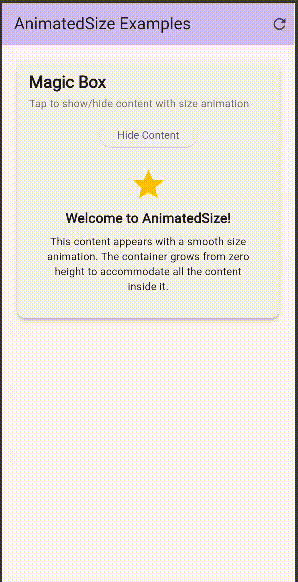

# Flutter AnimatedSize Widget Demo

AnimatedSize automatically animates its size when its child's size changes, providing smooth transitions for dynamic content.

## How to Run

1. Clone this repository
2. Run `flutter pub get` to install dependencies
3. Run `flutter run` to start the application

## Three Key Attributes of AnimatedSize

### 1. `duration` (required)
**Type**: Duration  
**Purpose**: Controls how long the size animation takes to complete  
**Example**: `Duration(milliseconds: 800)` creates a smooth, 0.8-second transition

### 2. `curve` (optional)
**Type**: Curve  
**Purpose**: Defines the animation's easing behavior for more natural movement  
**Example**: `Curves.bounceOut` adds a playful bounce effect at the animation's end

### 3. `child` (required)
**Type**: Widget  
**Purpose**: The widget whose size changes trigger the AnimatedSize animation  
**Example**: A Container that changes height based on whether content is shown or hidden

## Screenshot

*Three examples showing: content expansion, expandable container, and hover effects*
